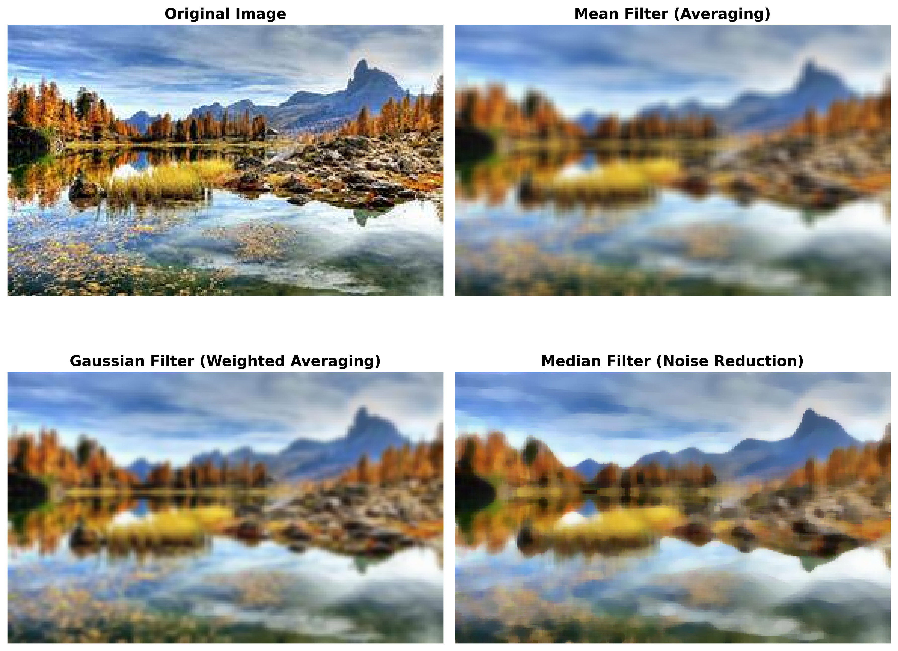

# Classical Image Filtering Techniques

## Project Overview
This project demonstrates classical image filtering techniques used in image processing to smooth images and reduce noise. Three fundamental filters are implemented and compared:

- **Mean Filter** (Simple Averaging)
- **Gaussian Filter** (Weighted Averaging)
- **Median Filter** (Noise Reduction)

## Technologies Used
- Python 3.11
- OpenCV (cv2)
- Matplotlib
- NumPy

## Filters Explained

### 1. Mean Filter
- Averages all pixel values in a neighborhood
- Good for general smoothing
- Can blur edges

### 2. Gaussian Filter
- Applies weighted averaging with more emphasis on center pixels
- Better edge preservation than mean filter
- Uses a Gaussian kernel

### 3. Median Filter
- Replaces each pixel with the median value of neighboring pixels
- Excellent for removing salt-and-pepper noise
- Preserves edges better than averaging filters

## Applications
- Medical image enhancement
- Noise reduction in photographs
- Pre-processing for computer vision tasks
- Image quality improvement

## Installation

### Prerequisites
Make sure Python 3.11 or later is installed.

### Install Required Libraries
pip install opencv-python matplotlib numpy

## How to Run

1. Clone or download this repository
2. Navigate to the project folder:
cd project-1

3. Run the script:
python filter.py

4. The program will:
- Load the sample image
- Apply three different filters
- Display the results in a window
- Save the output as `output_filters.png`

## Project Structure
project-1/
│
├── filter.py # Main Python script
├── Sample-1.jpg # Input image
├── output_filters.png # Output showing all filtered results
└── README.md # This file

## Output
The program generates a comparison view showing:
- Original Image
- Mean Filter result
- Gaussian Filter result
- Median Filter result

## Code Explanation

The code performs these steps:
1. Loads the input image using OpenCV
2. Converts from BGR to RGB color space for proper display
3. Applies three different filtering operations:
   - `cv2.blur()` for Mean Filter
   - `cv2.GaussianBlur()` for Gaussian Filter
   - `cv2.medianBlur()` for Median Filter
4. Displays all results in a 2x2 grid using Matplotlib
5. Saves the output as a high-resolution PNG file

## Parameters Used
- **Mean Filter kernel:** 7x7
- **Gaussian Filter kernel:** 7x7 with sigma=0 (auto-calculated)
- **Median Filter kernel:** 7x7
